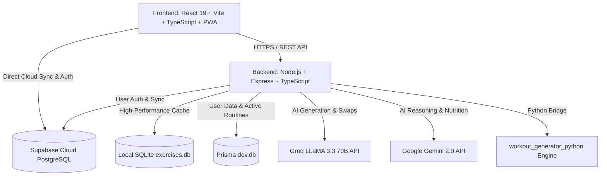

# 🦍 BeastMode AI — Next-Gen Smart Fitness & Nutrition Ecosystem

<p align="center">
  <a href="https://new-beast-mode-git-master-ma-k1.vercel.app/" target="_blank">
    
  </a>
  
  
  
  
  
  
  
  
  
  
  
  
</p>

---

## 🌐 التجربة الحية على السحابة | Live Production Web App

<p align="center">
  <a href="https://new-beast-mode-git-master-ma-k1.vercel.app/" target="_blank">
    <b>🚀 اضغط هنا لفتح وتجربة التطبيق المباشر على Vercel | Click Here to Launch Live App</b><br />
    <code>https://new-beast-mode-git-master-ma-k1.vercel.app/</code>
  </a>
</p>

---

## 🌟 نبذة عن المشروع | Overview

**BeastMode AI** هو نظام متكامل ومتقدم للياقة البدنية، وتوليد الجداول التدريبية وتحليل الأداء الرياضي مدعوم بالذكاء الاصطناعي الفائق. يجمع التطبيق بين تجربة مستخدم عصرية بتصميم زجاجي فاخر (**Glassmorphism**)، ومحرك ذكاء اصطناعي ثنائي (**Groq LLaMA 3.3 70B & Google Gemini AI**)، ومكتبة تمارين ضخمة تحتوي على أكثر من **4,298 تمرين مفصل** بالعربية والإنجليزية مع صور تشريحية وفيديوهات تعليمية.

> **BeastMode AI** is a cutting-edge, bilingual (AR/EN) AI-powered fitness and nutrition ecosystem. Featuring dynamic hyper-personalized training plans, interactive muscle anatomy maps, a global workout player with audio timers, and enterprise-grade security.

---

## ✨ أبرز الميزات والقدرات | Key Features

| الميزة | الوصف التقني |
| :--- | :--- |
| 🤖 **توليد الجداول الذكية (AI Workout Generation)** | توليد برامج تدريبية متكاملة ومخصصة بناءً على مستوى اللاعب، الأدوات المتاحة، والأهداف الرياضية عبر Groq و Gemini AI. |
| 🗺️ **خريطة العضلات التفاعلية (Interactive Body Map)** | خريطة تشريحية تفاعلية ثنائية الوجه (أمامي / خلفي) تتيح استعراض التمارين المستهدفة لكل عضلة بنقرة واحدة. |
| 📚 **مكتبة تمارين ضخمة (4,298+ Exercises)** | قاعدة بيانات شاملة للتمارين مدعمة بالتوجيهات الصوتية، صور التشريح، روابط MuscleWiki، وشروحات YouTube التكنيكية. |
| ⏱️ **مشغل التمارين العام (Global Workout Player)** | مشغل عائم يتيح تسجيل الجولات والأوزان، وتشغيل مؤقت الراحة الصوتي، وتتبع التكرارات في الوقت الفعلي. |
| 🔄 **استيراد الجداول النصية الذكي (Smart Bulk Parser)** | محلل نصوص مدعوم بالذكاء الاصطناعي يقوم بتحويل أي جدول تدريبي مكتوب كنص عادي إلى برنامج رقمي منظم فوراً. |
| 📱 **تطبيق ويب تقدمي متطور (PWA)** | يعمل دون اتصال بالإنترنت (Offline Mode)، يدعم التثبيت على الهاتف كأنه تطبيق Native، مع كاش تحديث ذكي NetworkFirst. |
| 🔐 **توثيق أمان متعدد الوسائط (Google & OTP Auth)** | تسجيل سلس بحساب Google مع ربط الحسابات التلقائي، وتأكيد بالبريد الإلكتروني، وتوليد رموز تحقق (OTP) لاستعادة الحساب. |
| 📊 **تحليلات الأداء وPR Tracker** | تتبع الأرقام القياسية الشخصية، وتطور الوزن ونسبة الدهون، وخريطة حرارية للالتزام الأسبوعي والشهري. |

---

## 🏗️ المعمارية التقنية | Architecture



---

## 🛡️ المعايير الأمنية والتحصين | Enterprise Security Hardening

تم تدقيق النظام واجتياز اختبارات الأمان السكونية والديناميكية (**Aikido Security & OWASP Top 10 Standards**):

- 🛡️ **منع حقن الأوامر (OS Command Injection):** استبدال استدعاءات `exec` بـ `execFile` وتمرير المعاملات كمصفوفات عناصر منفصلة.
- 🛡️ **منع حقن الاستعلامات (SQL & NoSQL Injection):** استخدام المعاملات المجهزة (Parameterized Queries) والتحقق الصارم من النصوص الأصلية (`primitive types`).
- 🛡️ **منع اختراق المسارات (Path Traversal Prevention):** تعقيم كافة مسارات قراءة وكتابة الملفات عبر `path.basename` وحصرها داخل المجلدات المصرح بها.
- 🛡️ **منع تزوير الطلبات (SSRF Protection):** تقييد اتصالات الـ Service Worker على النطاقات الموثوقة وقائمة بيضاء معتمدة للأصول الخارجية.
- 🛡️ **منع الهجمات الموجهة (DOM XSS Protection):** تطهير وفحص كافة الروابط الخارجية وقصرها على بروتوكول `https:` والنطاقات المعتمدة فقط.

---

## 📁 هيكل مجلدات المشروع | Directory Structure

```text
New BeastMode/
├── frontend/                   # واجهة المستخدم (React 19 + Vite + TypeScript)
│   ├── src/
│   │   ├── components/         # المكونات التفاعلية (BodyMap, MuscleWiki, GlobalPlayer)
│   │   ├── pages/              # الصفحات الرئيسية (Dashboard, MyPlan, ExerciseLibrary, Stats, Profile)
│   │   ├── services/           # خدمات الاتصال بالـ API و Supabase
│   │   └── utils/              # الترجمة (i18n)، التحقق، ومحرك البحث
│   └── public/                 # أيقونات PWA و Service Worker
│
├── backend/                    # السيرفر الخلفي (Express + TypeScript + Prisma)
│   ├── prisma/                 # مخطط قواعد البيانات وعلاقات الجداول
│   ├── src/
│   │   ├── controllers/        # معالجات التوثيق، التمارين، والذكاء الاصطناعي
│   │   ├── middleware/         # حماية JWT ومحددات معدل الطلبات (Rate Limiters)
│   │   ├── routes/             # مسارات REST API
│   │   ├── services/           # تكامل Groq و Gemini AI وقواعد البيانات
│   │   └── scripts/            # سكريبتات النسخ الاحتياطي ومزامنة التمارين
│
└── workout_generator_python/   # محرك بايثون وقاعدة بيانات التمارين (4,298 تمرين)
    ├── database/               # exercises.db
    └── src/                    # سكريبتات البحث، التوليد، والفهرسة
```

---

## 🚀 البدء السريع والتشغيل المحلي | Quick Start

### المتطلبات الأساسية (Prerequisites):
- **Node.js**: v18+ (يُفضل v22 LTS)
- **Python**: 3.10+
- **npm** أو **pnpm**

---

### 1️⃣ استنساخ المستودع (Clone Repository):
```bash
git clone https://github.com/Mak241288/New-Beast-Mode.git
cd New-Beast-Mode
```

---

### 2️⃣ إعداد وتشغيل السيرفر الخلفي (Backend Setup):
```bash
cd backend
npm install

# إعداد ملف البيئة (.env)
cp .env.example .env

# تهيئة وتوليد قاعدة البيانات
npx prisma migrate dev
npm run dev
```

---

### 3️⃣ إعداد وتشغيل الواجهة الأمامية (Frontend Setup):
```bash
cd ../frontend
npm install
npm run dev
```

---

### ⚡ روابط التشغيل والإنتاج | Access URLs:

- 🚀 **الرابط المباشر على السحابة (Live Production App):**  
  👉 **[https://new-beast-mode-git-master-ma-k1.vercel.app/](https://new-beast-mode-git-master-ma-k1.vercel.app/)**
- 💻 **الواجهة المحلية (Local Development):** `http://localhost:5173`
- ⚙️ **خادم الـ API المحلي (Local Backend API):** `http://localhost:5000`

---

## 🔑 متغيرات البيئة الأساسية | Environment Variables

| المتغير | الوصف | الفائدة |
| :--- | :--- | :--- |
| `PORT` | منفذ السيرفر الخلفي (الافتراضي `5000`) | خادم التطبيق |
| `DATABASE_URL` | مسار قاعدة بيانات Prisma (`file:./dev.db`) | تخزين بيانات المستخدمين |
| `JWT_SECRET` | مفتاح تشفير التوكن والـ Cookies | أمان الجلسات |
| `GROQ_API_KEY` | مفتاح واجهة Groq AI (LLaMA 3.3 70B) | توليد الخطط الفورية |
| `GEMINI_API_KEY` | مفتاح Google Gemini AI | التحليل الغذائي والتمارين |
| `SUPABASE_URL` | رابط مشروع Supabase السحابي | المزامنة والتخزين السحابي |
| `SUPABASE_ANON_KEY` | المفتاح المجهول لـ Supabase | مصادقة العملاء |

---

## 🧪 التحقق والاختبارات | Verification & Build

للتأكد من سلامة الكود وخلوه من أي أخطاء برمجية أو نوعية (TypeScript Zero-Error Check):

```bash
# فحص وبناء الواجهة الأمامية
cd frontend && npm run build

# فحص وبناء السيرفر الخلفي
cd ../backend && npm run build
```

---

## 📜 الترخيص | License

هذا المشروع مرخص تحت رخصة **MIT License**. يحق لك استخدامه وتطويره بحرية.

<p align="center">
  صُنع بشغف وإتقان لتمكين الرياضيين حول العالم 🦍🔥<br />
  <b>Crafted with ❤️ for Beasts and Fitness Champions Worldwide.</b>
</p>
