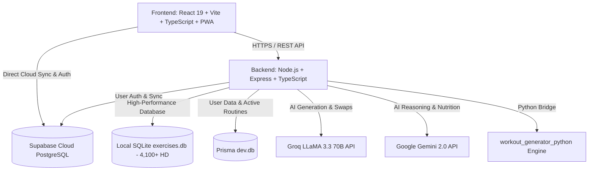

# 🦍 BeastMode AI — Next-Gen Smart Fitness & Nutrition Ecosystem

<p align="center">
  <a href="https://new-beast-mode-git-master-ma-k1.vercel.app/" target="_blank">
    
  </a>
  
  
  
  
  
  
  
  
  
  
  
  
  
</p>

---

## 🌐 التجربة الحية على السحابة | Live Production Web App

<p align="center">
  <a href="https://new-beast-mode-git-master-ma-k1.vercel.app/" target="_blank">
    <b>🚀 اضغط هنا لفتح وتجربة التطبيق المباشر على Vercel | Click Here to Launch Live App</b><br />
    <code>https://new-beast-mode-git-master-ma-k1.vercel.app/</code>
  </a>
</p>

---

## 🌟 نبذة عن المشروع | Overview

**BeastMode AI** هو نظام رياضي بيئي متكامل وفائق التطور للياقة البدنية، وبناء الأجسام، وتوليد الجداول التدريبية وتحليل الأداء الرياضي مدعوم بالذكاء الاصطناعي الفائق. يتميز بهوية بصرية حصرية **(⚡ Cyber-Volt & Matte Carbon)** بتصميم زجاجي فاخر (**Glassmorphism**)، ومحرك ذكاء اصطناعي ثنائي (**Groq LLaMA 3.3 70B & Google Gemini AI**)، ومكتبة تمارين ضخمة تضم **+4,100 تمرين موثق بدقة HD** بالعربية والإنجليزية.

> **BeastMode AI** is a cutting-edge, bilingual (AR/EN) AI-powered fitness and nutrition ecosystem. Featuring signature **Cyber-Volt** aesthetics, dynamic hyper-personalized training plans, interactive 3D muscle anatomy maps, a zero-latency global workout player with audio timers, visual routine cards export, and enterprise-grade security.

---

## ✨ أبرز الميزات والقدرات المحدثة | Key Features

| الميزة | الوصف التقني |
| :--- | :--- |
| ⚡ **هوية Cyber-Volt ومبدّل الثيمات (Theme Engine)** | هوية رياضية نخبوية (الأصفر الكهربائي والأسود الكربوني) مع مبدّل ألوان فوري يتيح التبديل بين (⚡ Cyber Volt, 🔥 Crimson Beast, 👑 Imperial Gold, 💎 Aurora Cyan). |
| 📷 **تصدير البطاقة التدريبية السينمائية (Visual Routine Card)** | توليد وتصدير بطاقات داكنة عالية الدقة للجداول اليومية والأسبوعية للطباعة، الحفظ في ألبوم الصور كـ PDF، أو المشاركة كصورة ستوري وواتساب. |
| 🤸‍♂️ **مؤقت الإحماء الحركي الذكي (3-Min Dynamic Warmup)** | بروتوكول إحماء حركي مخصص لعضلات اليوم (3 دقائق) لتليين المفاصل وتجهيز الجهاز العصبي وتفادي الإصابات مع مؤقت وجرس ملاكمة. |
| 🗺️ **المجسم التشريحي التفاعلي المتزامن (Live Anatomy Sync)** | إضاءة العضلات المستهدفة اليوم في الداشبورد تلقائياً على مجسم ثلاثي الأبعاد مع توجيهات التكنيك والشروحات التشريحية بنقرة واحدة. |
| ⚡ **وضع "أنا مستعجل" (Express 30-Min Workout Mode)** | تكثيف الحصة التدريبية لـ 30 دقيقة بالتركيز على الحركات المركبة (Compound Lifts) مع تقليص الراحة لـ 45-60 ثانية للأيام المزدحمة. |
| 📸 **مقارنة التطور بشريط السحب (Before/After Split Slider)** | أداة مقارنة تفاعلية بالسحب للمقارنة بين صور بداية المشوار والصورة الحالية لفحص تفاصيل التناسق العضلي ونسبة الدهون. |
| 🔄 **الاستبدال الذكي للتمارين (Smart 1-Click Swap)** | زر استبدال فوري داخل الجدول يتيح اختيار تمارين بديلة لنفس العضلة مع بحث ضبابي فوري عبر +4,100 تمرين. |
| 🤖 **توليد الجداول بالذكاء الاصطناعي (AI Workout Generation)** | توليد خطط مخصصة بناءً على مستوى اللاعب، الأدوات المتاحة، وموقع التمرين (جيم / منزل) عبر Groq LLaMA 3.3 و Gemini AI. |
| 🥗 **مدرب الماكروز وتدوير السعرات (Smart Nutrition & TDEE)** | حساب دقيق للـ BMR و TDEE بمعادلة Mifflin-St Jeor مع تدوير الماكروز (+6% أيام التمرين، -6% أيام الراحة) وتتبع الماء والنوم. |
| 🏋️ **محاكي صفائح البار والـ 1RM (Barbell Plate Loader)** | محاكي بصري ملون لصفائح البار الأولمبي وحساب الأوزان الدقيقة لكل جهة مع حاسبة القوة القصوى 1RM وجداول النسب المئوية. |
| ⏱️ **مشغل التمارين التفاعلي (Global Workout Player)** | مشغل عائم بدون تأخير مع باقات أصوات مؤقت الراحة (جرس ملاكمة وصافرة حكم)، نبض توهج لآخر 5 ثوانٍ، وتخزين أوفلاين. |
| 📱 **تطبيق ويب تقدمي متطور (Offline PWA)** | يعمل 100% بدون إنترنت داخل صالات الجيم السفلية، يدعم التثبيت المباشر على الهاتف مع كاش ذكي فائق السرعة. |
| 🔐 **حماية بيانات وتوثيق متقدم (OWASP & Google OAuth)** | تسجيل دخول سريع بحساب Google بضغطة زر، تأكيد بالبريد الإلكتروني، واستعادة الحساب برموز OTP مع تشفير وحماية OWASP كاملة. |

---

## 🎨 النظام البصري والهوية الرياضية | Signature Design System

```text
🎨 Primary Identity: ⚡ Cyber-Volt (#CCFF00) on Matte Obsidian Carbon (#08090D)
✨ Micro-Interactions:
   ├── Glass Shimmer Sweep (تأثير اللمعة الزجاجية على الأزرار)
   ├── Ambient Breathing Glow (نبض النيون المحيطي للبطاقات النشطة)
   ├── Critical Timer Ripple (نبض المؤقت الدائري لآخر 5 ثوانٍ)
   └── Top Scroll Progress Bar (شريط تقدم الصفحة النيون في قمة الشاشة)
```

---

## 🏗️ المعمارية التقنية | Architecture



---

## 🛡️ المعايير الأمنية والتحصين | Enterprise Security Hardening

تم تدقيق النظام واجتياز اختبارات الأمان السكونية والديناميكية (**Aikido Security & OWASP Top 10 Standards**):

- 🛡️ **منع حقن الأوامر (OS Command Injection):** استبدال استدعاءات `exec` بـ `execFile` وتمرير المعاملات كمصفوفات عناصر منفصلة.
- 🛡️ **منع حقن الاستعلامات (SQL & NoSQL Injection):** استخدام المعاملات المجهزة (Parameterized Queries) والتحقق الصارم من النصوص الأصلية (`primitive types`).
- 🛡️ **منع اختراق المسارات (Path Traversal Prevention):** تعقيم كافة مسارات قراءة وكتابة الملفات عبر `path.basename` وحصرها داخل المجلدات المصرح بها.
- 🛡️ **منع تزوير الطلبات (SSRF Protection):** تقييد اتصالات الـ Service Worker على النطاقات الموثوقة وقائمة بيضاء معتمدة للأصول الخارجية.
- 🛡️ **منع الهجمات الموجهة (DOM XSS Protection):** تطهير وفحص كافة الروابط الخارجية وقصرها على بروتوكول `https:` والنطاقات المعتمدة فقط.

---

## 📁 هيكل مجلدات المشروع | Directory Structure

```text
New BeastMode/
├── frontend/                   # واجهة المستخدم (React 19 + Vite + TypeScript + PWA)
│   ├── src/
│   │   ├── components/         # المكونات (RoutineCardExport, DynamicWarmup, BodyMap, MuscleWiki, GlobalPlayer)
│   │   ├── pages/              # الصفحات (Dashboard, MyPlan, ExerciseLibrary, Stats, Profile, LandingPage)
│   │   ├── context/            # إدارة الحالة (WorkoutSessionContext)
│   │   ├── services/           # خدمات الاتصال بالـ API و Supabase
│   │   ├── styles/             # نظام التصميم (design-system.css)
│   │   └── utils/              # الترجمة (i18n)، التحقق، محرك الصوت، والبحث الضبابي
│   └── public/                 # أيقونات PWA و Service Worker
│
├── backend/                    # السيرفر الخلفي (Express + TypeScript + Prisma)
│   ├── prisma/                 # مخطط قواعد البيانات وعلاقات الجداول
│   ├── src/
│   │   ├── controllers/        # معالجات التوثيق، التمارين، والذكاء الاصطناعي
│   │   ├── middleware/         # جدار الحماية، Rate Limiting، وفحص التوكنات
│   │   ├── routes/             # مسارات الـ API المحمية
│   │   └── services/           # تكامل Groq AI و Gemini AI
│   └── .env.example            # نموذج المتغيرات البيئية
│
└── workout_generator_python/   # محرك التمارين الذكي
    ├── database/               # exercises.db (+4,100 تمرين مفصل)
    └── src/                    # سكربتات التوليد والفهرسة السريعة
```

---

## 🚀 التشغيل المحلي والتطوير | Local Setup

```bash
# 1. استنساخ المستودع
git clone https://github.com/Mak241288/New-Beast-Mode.git
cd "New BeastMode"

# 2. تشغيل السيرفر الخلفي (Backend)
cd backend
npm install
npm run dev

# 3. تشغيل الواجهة الأمامية (Frontend)
cd ../frontend
npm install
npm run dev
```

---

## 📄 الترخيص | License

هذا المشروع مطور ومحمي تحت رخصة **MIT License**. جميع الحقوق محفوظة لـ **BeastMode AI Ecosystem © 2026**.
