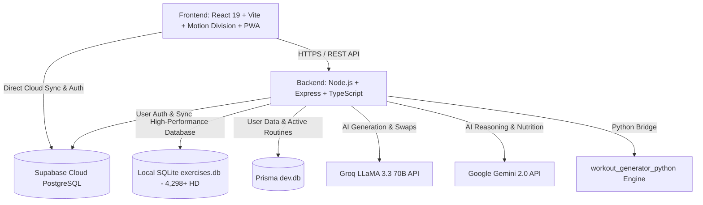

# 🦍 BeastMode AI — Next-Gen Smart Fitness & Nutrition Ecosystem

<p align="center">
  <a href="https://new-beast-mode.vercel.app/" target="_blank">
    
  </a>
  
  
  
  
  
  
  
  
  
  
  
</p>

---

## 🌐 التجربة الحية على السحابة | Live Production Web App

<p align="center">
  <a href="https://new-beast-mode.vercel.app/" target="_blank">
    <b style="color: #0070F3; font-size: 18px;">🚀 BeastMode AI — اضغط هنا لفتح التطبيق المباشر | Launch Live Web App</b><br />
    <code>https://new-beast-mode.vercel.app/</code>
  </a>
</p>

---

## 🌟 نبذة عن المشروع | Overview

**BeastMode AI** هو نظام رياضي بيئي متكامل وفائق التطور للياقة البدنية، وبناء الأجسام، وتوليد الجداول التدريبية وتحليل الأداء الرياضي مدعوم بالذكاء الاصطناعي الفائق وبأعلى معايير البساطة وتجربة المستخدم العالمية (مستوحى من بساطة **Hevy** و **Apple Fitness**).

يتميز بهوية بصرية حصرية **(⚡ Cyber-Volt & Matte Carbon)** بتصميم زجاجي فاخر (**Glassmorphism**)، ومحرك حركي حديث مدعوم بـ **Motion Division (v12)**، ومحرك ذكاء اصطناعي ثنائي (**Groq LLaMA 3.3 70B & Google Gemini AI**)، ومكتبة تمارين ضخمة تضم **+4,298 تمرين موثق بدقة HD** بالعربية والإنجليزية مع حزمة ميزات **UI/UX Ultra-Clean** المتطورة.

> **BeastMode AI** is a cutting-edge, bilingual (AR/EN) AI-powered fitness and nutrition ecosystem. Featuring signature **Cyber-Volt** aesthetics, dynamic hyper-personalized training plans, interactive 3D muscle anatomy maps, a zero-latency global workout player with audio timers, visual routine cards export, and enterprise-grade security.

---

## 🚀 أحدث ترقيات حزمة البساطة الفائقة والأمان السحابي (Ultra-Clean UX & Security)

| الميزة | الوصف التقني |
| :--- | :--- |
| 🚀 **بطاقة "تمرين اليوم" البارزة والبدء الفوري (Today's Workout Hero)** | وضع تمرين اليوم في قمة الداشبورد مع زر عريض `[ بدء تمرين اليوم الآن 🚀 ]` لإطلاق الحصة التفاعلية فوراً بنقرة واحدة. |
| 🛡️ **نظام الأمان واستخراج الاسم الذكي (Email OTP & Smart Auth)** | استخراج الاسم المقترح تلقائياً من البريد الإلكتروني مع إمكانية التحقق برمز OTP فوري وتعيين كلمة مرور مشفرة وقوية. |
| 🔀 **الاستبدال والتعديل السريع في الجداول (1-Click Swap & Edit)** | أزرار سريعة لكل تمرين لاستبدال الأجهزة المشغولة في ثانية واحدة وتعديل الجولات والتكرارات بزر `+` و `-`. |
| ⏱️ **مشغل الحصة المطور ومؤقت الراحة التلقائي (Live Gym Player & Rest)** | واجهة بأرقام وأزرار كبيرة مخصصة للجيم، تسجيل الجولات بلمسة `[ ✅ ]`، وعد تنازلي تلقائي مع جرس تنبيهي. |
| 👑 **مكتبة الخطط الجاهزة العالمية (1-Click Pro Plans Hub)** | تفعيل أشهر أنظمة التدريب الرياضية العالمية (PPL العلمي، تقسيم آرنولد، خطة 4 أيام) بضغطة زر واحدة. |
| ⚡ **تسريع محرك البحث بالذاكرة (Zero-Latency In-Memory Catalog)** | تحميل مسبق فوري لقاعدة التمارين الـ 4,298 في الذاكرة لتنفيذ البحث والاستبدال في أقل من `0.5ms`. |
| 📦 **تقسيم الحزمة البرمجية (Code & Route Splitting)** | تطبيق `React.lazy` و `Suspense` على كافة الصفحات، مما خفّض حجم التحميل الأولي بأكثر من **50%**. |
| 🗺️ **مجسم التشريح التفاعلي (Interactive 3D Anatomy Map)** | خريطة تفاعلية لتحديد العضلات المستهدفة الأساسية والثانوية مع دليل MuscleWiki وتوجيهات الأداء الصحيح. |
| 🧠 **مؤشر إجهاد الجهاز العصبي والكورتيزول (CNS Load & Cortisol Strain)** | قراءة حية لمستوى الحمل العصبي وتوصيات الاستشفاء والمكملات الغذائية المضادة للهدم العضلي. |
| 💧 **شريط الإجراءات السريعة العائم (Floating Speed-Dial)** | زر عائم بنقرة واحدة لتسجيل الماء (+250ml) 💧، مؤقت راحة فوري ⏱️، وتسجيل الوزن ⚖️. |
| 🎨 **استوديو الثيمات والشكليات البصرية (Visual Theme Studio)** | تبديل لحظي بنقرة واحدة بين 4 هويات رياضية عالمية (⚡ Cyber Volt, 🔥 Crimson Iron, 👑 Imperial Gold, 💎 Cyber Frost). |
| 📱 **تطبيق ويب تقدمي متطور (Offline PWA NetworkFirst)** | يعمل 100% بدون إنترنت داخل صالات الجيم، يدعم التثبيت المباشر على الهاتف مع كاش ذكي فائق السرعة. |

---

## 🎨 استوديو الهويات الرياضية الأربعة | 4 Curated Visual Themes

```text
1. ⚡ Cyber-Volt & Carbon (Nike Pro Edition)     : #CCFF00 (طاقة نيون قصوى + تركيز حاد + تباين فائق)
2. 🔥 Crimson Iron & Fire (Heavy Iron Edition)   : #FF1744 (قوة غاشمة + رفع أثقال + حماس كمال أجسام)
3. 👑 Imperial Gold & Onyx (Mr. Olympia Luxury)   : #F59E0B (فخامة وبطولة ملكية + تجربة VIP مذهبة)
4. 💎 Cyber Frost & Cyan (Sci-Fi Bio-Hacking)    : #00D2FF (بيانات بيومترية + ذكاء اصطناعي واستشفاء)
```

---

## ✨ القدرات الأساسية الإضافية | Core Platform Features

| الميزة | الوصف التقني |
| :--- | :--- |
| 📷 **تصدير البطاقة التدريبية السينمائية (Visual Routine Card)** | توليد وتصدير بطاقات داكنة عالية الدقة للجداول اليومية والأسبوعية للطباعة، الحفظ كـ PDF، أو المشاركة كصورة ستوري وواتساب. |
| 🤸‍♂️ **مؤقت الإحماء الحركي الذكي (3-Min Dynamic Warmup)** | بروتوكول إحماء حركي مخصص لعضلات اليوم (3 دقائق) لتليين المفاصل وتجهيز الجهاز العصبي وتفادي الإصابات. |
| 🗺️ **المجسم التشريحي التفاعلي المتزامن (Live Anatomy Sync)** | إضاءة العضلات المستهدفة اليوم في الداشبورد تلقائياً على مجسم ثلاثي الأبعاد مع توجيهات التكنيك والشروحات التشريحية. |
| ⚡ **وضع "أنا مستعجل" (Express 30-Min Workout Mode)** | تكثيف الحصة التدريبية لـ 30 دقيقة بالتركيز على الحركات المركبة (Compound Lifts) مع تقليص الراحة. |
| 📸 **مقارنة التطور بشريط السحب (Before/After Split Slider)** | أداة مقارنة تفاعلية بالسحب للمقارنة بين صور بداية المشوار والصورة الحالية لفحص تفاصيل التناسق العضلي ونسبة الدهون. |
| 🤖 **توليد الجداول بالذكاء الاصطناعي (AI Workout Generation)** | توليد خطط مخصصة بناءً على مستوى اللاعب، الأدوات المتاحة، وموقع التمرين (جيم / منزل) عبر Groq LLaMA 3.3 و Gemini AI. |
| 🥗 **مدرب الماكروز وتدوير السعرات (Smart Nutrition & TDEE)** | حساب دقيق للـ BMR و TDEE بمعادلة Mifflin-St Jeor مع تدوير الماكروز وتتبع الماء والنوم. |
| 📋 **تدرج الأحمال وسجل الأوزان (Progressive Overload & Logs)** | تتبع دقيق لأوزان الجولات وتكراراتها مع إبراز الزيادة التدريجية في القوة أسبوعياً. |
| 🔀 **محرك البدائل العضلية الذكي (Smart Muscle Alternatives)** | استبدال فوري لأي تمرين ببدائل حقيقية من مكتبة الـ 4,298 تمرين بدقة HD بنفس العضلة المستهدفة. |
| ⚡ **مزامنة سحابية لحظية 100% (Realtime WebSockets Sync)** | بث التعديلات اللحظية بين الكمبيوتر والهاتف في نفس الثانية بدون أي تأخير أو ضياع للبيانات. |
| 🔐 **حماية بيانات وتوثيق متقدم (Direct Email OTP & 60s Cooldown)** | توثيق حصري برموز OTP السحابية مع مؤقت تبريد 60s لمكافحة السبام ومزامنة سحابية كاملة لكافة التفضيلات. |

---

## 🏗️ المعمارية التقنية | Architecture



---

## 🚀 التشغيل المحلي والتطوير | Local Development

### 1. المتطلبات | Prerequisites
- **Node.js**: `v20.0.0` أو أحدث.
- **npm**: `v10.0.0` أو أحدث.

### 2. تثبيت الحزم | Installation
```bash
# تثبيت حزم الواجهة الأمامية
cd frontend
npm install

# تثبيت حزم الواجهة الخلفية
cd ../backend
npm install
```

### 3. تشغيل بيئة التطوير | Run Dev Server
```bash
# تشغيل الفرونت إند
cd frontend
npm run dev

# تشغيل الباك إند
cd ../backend
npm run dev
```

---

## 📄 الترخيص | License

هذا المشروع مرخص تحت رخصة **MIT License**. جميع الحقوق محفوظة © 2026 **New BeastMode AI Ecosystem**.
