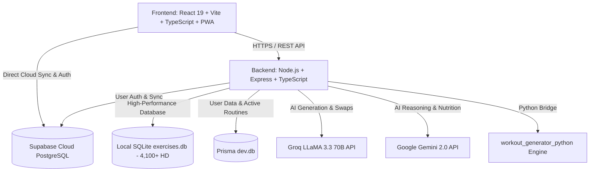

# 🦍 BeastMode AI — Next-Gen Smart Fitness & Nutrition Ecosystem

<p align="center">
  <a href="https://new-beast-mode-git-master-ma-k1.vercel.app/" target="_blank">
    
  </a>
  
  
  
  
  
  
  
  
  
  
</p>

---

## 🌐 التجربة الحية على السحابة | Live Production Web App

<p align="center">
  <a href="https://new-beast-mode-git-master-ma-k1.vercel.app/" target="_blank">
    <b>🚀 اضغط هنا لفتح وتجربة التطبيق المباشر على Vercel | Click Here to Launch Live App</b><br />
    <code>https://new-beast-mode-git-master-ma-k1.vercel.app/</code>
  </a>
</p>

---

## 🌟 نبذة عن المشروع | Overview

**BeastMode AI** هو نظام رياضي بيئي متكامل وفائق التطور للياقة البدنية، وبناء الأجسام، وتوليد الجداول التدريبية وتحليل الأداء الرياضي مدعوم بالذكاء الاصطناعي الفائق. يتميز بهوية بصرية حصرية **(⚡ Cyber-Volt & Matte Carbon)** بتصميم زجاجي فاخر (**Glassmorphism**)، ومحرك ذكاء اصطناعي ثنائي (**Groq LLaMA 3.3 70B & Google Gemini AI**)، ومكتبة تمارين ضخمة تضم **+4,100 تمرين موثق بدقة HD** بالعربية والإنجليزية مع حزمة ميزات **UI/UX Pro Max** العالمية.

> **BeastMode AI** is a cutting-edge, bilingual (AR/EN) AI-powered fitness and nutrition ecosystem. Featuring signature **Cyber-Volt** aesthetics, dynamic hyper-personalized training plans, interactive 3D muscle anatomy maps, a zero-latency global workout player with audio timers, visual routine cards export, and enterprise-grade security.

---

## 🚀 أحدث ترقيات حزمة UI/UX Pro Max | UI/UX Pro Max 14-Feature Suite

| الميزة | الوصف التقني |
| :--- | :--- |
| ⏱️ **مؤقت الراحة الدائري النيون (Circular Rest Ring)** | حلقة عد تنازلي تفاعلية بـ SVG متحرك مع تحول لوني ذكي (نيون ➔ أصفر ➔ نبض أحمر في آخر 5 ثوانٍ). |
| 🔊 **التنبيهات الصوتية الإجرائية (Web Audio Synthesizer)** | نظام توليد نغمات رقمية خفيفة بدون أي ملفات خارجية (عد تنازلي 3.. 2.. 1 وموسيقى نصر احتفالية مع زر كتم الصوت). |
| 🎉 **احتفالية إنهاء التمرين (Confetti HUD & Volume Summary)** | نافذة احتفالية تفاعلية بجزيئات كونفيتي ملونة تلخص إجمالي الوزن المرفوع بالكيلوغرام، السعرات المحروقة، ومدة التمرين. |
| 🔀 **درج الاستبدال الذكي للأجهزة المشغولة (Smart Swap Drawer)** | نافذة سفلية تقدم 3 بدائل فورية لنفس العضلة عند انشغال أجهزة الجيم مع الحفاظ على تسلسل الجولات والأوزان. |
| 📊 **أشرطة الكثافة العضلية ومصفوفة الاستشفاء (Volume Bullet Bars)** | قياس جولات كل عضلة أسبوعياً مقارنة بالنطاق البنائي المثالي (10-20 جولة) مع تلوين حالة الاستشفاء (🟢 جاهزة \| 🟡 استشفاء \| 🔴 مجهدة). |
| 📱 **لوحة المفاتيح الرقمية للهواتف (Smart Numeric Keypads)** | استخدام `inputmode="decimal"` لفتح لوحة الأرقام الكبيرة والواضحة فوراً عند تسجيل الأوزان والتكرارات على الهواتف. |
| 💧 **شريط الإجراءات السريعة العائم (Floating Speed-Dial)** | زر عائم بنقرة واحدة لتسجيل الماء (+250ml) 💧، مؤقت راحة فوري ⏱️، وتسجيل الوزن ⚖️. |
| 🦴 **شاشات التحميل الشبحية الزجاجية (Skeleton Shimmer)** | بطاقات زجاجية ببريق ناعم متحرك تمنع وميض النصوص أو تقطيع الشاشات أثناء تحميل البيانات (`Zero Layout Shift`). |
| ✍️ **الطباعة والخطوط الرياضية (Barlow Condensed + Cairo)** | دمج خط `Barlow Condensed` للأرقام والأوزان والـ PR مع خط `Cairo` العربي للعناوين الرياضية. |
| 🎨 **استوديو الثيمات والشكليات البصرية (Visual Theme Studio)** | تبديل لحظي بنقرة واحدة بين 4 هويات رياضية عالمية (⚡ Cyber Volt, 🔥 Crimson Iron, 👑 Imperial Gold, 💎 Cyber Frost). |
| 🖨️ **محرك الطباعة الورقية فائق الوضوح (Crisp Print Engine)** | فتح وتوسيع كافة أيام الأسبوع تلقائياً عند الطباعة مع تنسيق عالي التباين وجداول واضحة بالأبيض والأسود. |

---

## 🎨 استوديو الهويات الرياضية الأربعة | 4 Curated Visual Themes

```text
1. ⚡ Cyber-Volt & Carbon (Nike Pro Edition)     : #CCFF00 (طاقة نيون قصوى + تركيز حاد + تباين فائق)
2. 🔥 Crimson Iron & Fire (Heavy Iron Edition)   : #FF1744 (قوة غاشمة + رفع أثقال + حماس كمال أجسام)
3. 👑 Imperial Gold & Onyx (Mr. Olympia Luxury)   : #F59E0B (فخامة وبطولة ملكية + تجربة VIP مذهبة)
4. 💎 Cyber Frost & Cyan (Sci-Fi Bio-Hacking)    : #00D2FF (بيانات بيومترية + ذكاء اصطناعي واستشفاء)
```

---

## ✨ القدرات الأساسية الإضافية | Core Platform Features

| الميزة | الوصف التقني |
| :--- | :--- |
| 📷 **تصدير البطاقة التدريبية السينمائية (Visual Routine Card)** | توليد وتصدير بطاقات داكنة عالية الدقة للجداول اليومية والأسبوعية للطباعة، الحفظ كـ PDF، أو المشاركة كصورة ستوري وواتساب. |
| 🤸‍♂️ **مؤقت الإحماء الحركي الذكي (3-Min Dynamic Warmup)** | بروتوكول إحماء حركي مخصص لعضلات اليوم (3 دقائق) لتليين المفاصل وتجهيز الجهاز العصبي وتفادي الإصابات. |
| 🗺️ **المجسم التشريحي التفاعلي المتزامن (Live Anatomy Sync)** | إضاءة العضلات المستهدفة اليوم في الداشبورد تلقائياً على مجسم ثلاثي الأبعاد مع توجيهات التكنيك والشروحات التشريحية. |
| ⚡ **وضع "أنا مستعجل" (Express 30-Min Workout Mode)** | تكثيف الحصة التدريبية لـ 30 دقيقة بالتركيز على الحركات المركبة (Compound Lifts) مع تقليص الراحة. |
| 📸 **مقارنة التطور بشريط السحب (Before/After Split Slider)** | أداة مقارنة تفاعلية بالسحب للمقارنة بين صور بداية المشوار والصورة الحالية لفحص تفاصيل التناسق العضلي ونسبة الدهون. |
| 🤖 **توليد الجداول بالذكاء الاصطناعي (AI Workout Generation)** | توليد خطط مخصصة بناءً على مستوى اللاعب، الأدوات المتاحة، وموقع التمرين (جيم / منزل) عبر Groq LLaMA 3.3 و Gemini AI. |
| 🥗 **مدرب الماكروز وتدوير السعرات (Smart Nutrition & TDEE)** | حساب دقيق للـ BMR و TDEE بمعادلة Mifflin-St Jeor مع تدوير الماكروز وتتبع الماء والنوم. |
| 🏋️ **محاكي صفائح البار والـ 1RM (Barbell Plate Loader)** | محاكي بصري ملون لصفائح البار الأولمبي وحساب الأوزان الدقيقة لكل جهة مع حاسبة القوة القصوى 1RM. |
| 📱 **تطبيق ويب تقدمي متطور (Offline PWA)** | يعمل 100% بدون إنترنت داخل صالات الجيم السفلية، يدعم التثبيت المباشر على الهاتف مع كاش ذكي فائق السرعة. |
| 🔐 **حماية بيانات وتوثيق متقدم (OWASP & Google OAuth)** | تسجيل دخول سريع بحساب Google بضغطة زر، تأكيد بالبريد الإلكتروني، واستعادة الحساب برموز OTP مع تشفير OWASP كامل. |

---

## 🏗️ المعمارية التقنية | Architecture



---

## 📁 هيكل مجلدات المشروع | Directory Structure

```text
New BeastMode/
├── frontend/                   # واجهة المستخدم (React 19 + Vite + TypeScript + PWA)
│   ├── src/
│   │   ├── components/         # المكونات (CircularRestTimer, ConfettiHUD, SmartSwap, FloatingSpeedDial, SkeletonLoader)
│   │   ├── pages/              # الصفحات (Dashboard, MyPlan, ExerciseLibrary, Stats, Profile, LandingPage)
│   │   ├── context/            # إدارة الحالة (WorkoutSessionContext)
│   │   ├── services/           # خدمات الاتصال بالـ API و Supabase
│   │   ├── styles/             # نظام التصميم (design-system.css)
│   │   └── utils/              # الترجمة (i18n)، التحقق، محرك الصوت audioCues، والبحث الضبابي
│   └── public/                 # أيقونات PWA و Service Worker
│
├── backend/                    # السيرفر الخلفي (Express + TypeScript + Prisma)
│   ├── prisma/                 # مخطط قواعد البيانات وعلاقات الجداول
│   ├── src/
│   │   ├── controllers/        # معالجات التوثيق، التمارين، والذكاء الاصطناعي
│   │   ├── middleware/         # جدار الحماية، Rate Limiting، وفحص التوكنات
│   │   ├── routes/             # مسارات الـ API المحمية
│   │   └── services/           # تكامل Groq AI و Gemini AI
│   └── .env.example            # نموذج المتغيرات البيئية
│
└── workout_generator_python/   # محرك التمارين الذكي
    ├── database/               # exercises.db (+4,100 تمرين مفصل)
    └── src/                    # سكربتات التوليد والفهرسة السريعة
```

---

## 🚀 التشغيل المحلي والتطوير | Local Setup

```bash
# 1. استنساخ المستودع
git clone https://github.com/Mak241288/New-Beast-Mode.git
cd "New BeastMode"

# 2. تشغيل السيرفر الخلفي (Backend)
cd backend
npm install
npm run dev

# 3. تشغيل الواجهة الأمامية (Frontend)
cd ../frontend
npm install
npm run dev
```

---

## 🔒 الحقوق والملكية | Copyright

جميع الحقوق محفوظة لـ **BeastMode AI Ecosystem © 2026**. All Rights Reserved.
