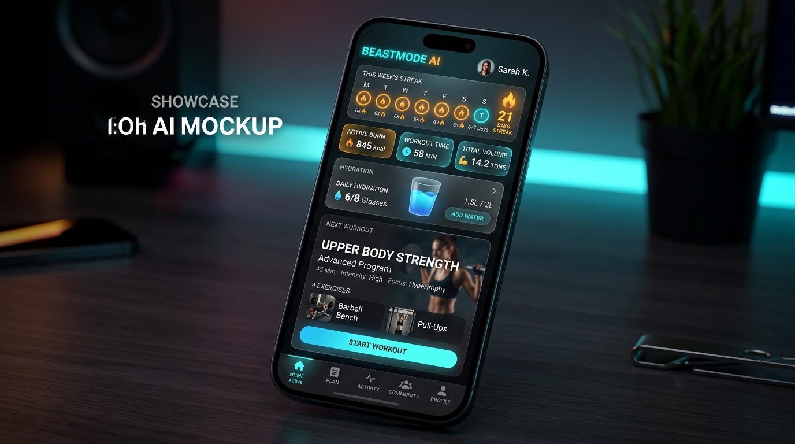
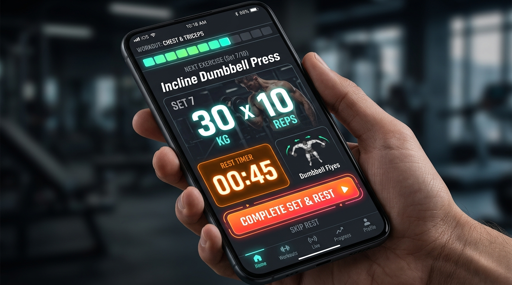
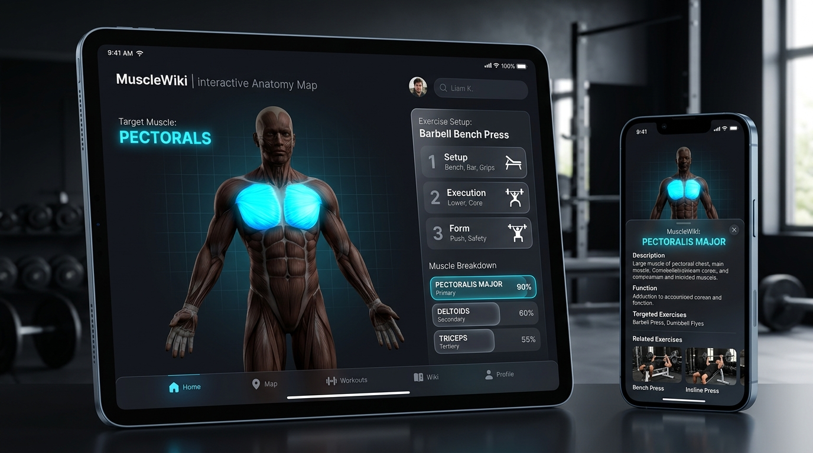
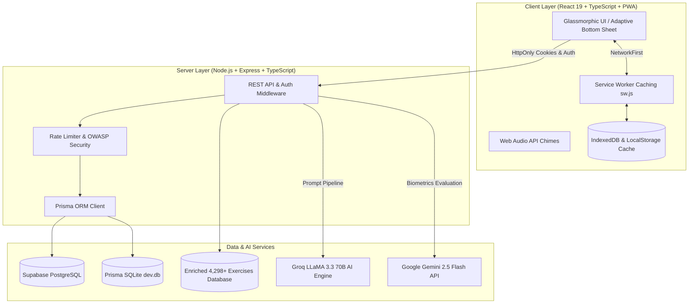

# 🦍 BeastMode AI — Next-Gen Smart Fitness & Nutrition Ecosystem

<p align="center">
  <a href="https://new-beast-mode.vercel.app/" target="_blank">
    
  </a>
  
  
  
  
  
  
  
  
</p>

---

## 🌐 Live Cloud Deployment

Experience the live, production-ready progressive web application directly in your browser or install it on your mobile device:

<p align="center">
  <a href="https://new-beast-mode.vercel.app/" target="_blank">
    <b style="color: #00d2ff; font-size: 20px;">🚀 Launch BeastMode Live App (Vercel)</b><br />
    <code>https://new-beast-mode.vercel.app/</code>
  </a>
</p>

---

## 📸 Interface & Live Experience Showcase

<p align="center">
  
</p>

<p align="center">
  <em>⚡ Dynamic Glassmorphism Dashboard: Weekly Streaks, Trio Metric Pills, Live Hydration & Cinematic Cards.</em>
</p>

<br />

<table align="center" width="100%">
  <tr>
    <td width="50%" align="center">
      
      <br />
      <b>🏋️ Zero-Latency Live Player & Story Segments</b>
    </td>
    <td width="50%" align="center">
      
      <br />
      <b>🗺️ 3D Muscle Anatomy & MuscleWiki 1-2-3 Guide</b>
    </td>
  </tr>
</table>

---

## 🌟 Key Features & Architectural Highlights

### 1. 🏋️‍♂️ Zero-Latency Live Gym Player
* **Story-Style Segmented Progress**: Glanceable top bar showing current session progression with active pulse and one-tap exercise skipping.
* **Giant 1-Tap Logging**: Built for chalky fingers and heavy breathing. Complete sets and launch the countdown rest timer with a single tap (or keyboard Spacebar).
* **Native Offline Synthesized Audio Chime**: Web Audio API audio bells (0 KB asset footprint, 100% offline).

### 2. 🤖 Biomechanical AI Coach (Groq LLaMA 3.3 & Gemini 2.5 Flash)
* **Physiological Check-Ins**: Evaluates workout sensation, weekly adherence, joint pain, water hydration consistency, and tape circumference measurements (chest/arm growth vs waist reduction).
* **Calibrated Progressive Overload**: Recommends exact micro-load increments (+2.5kg or +1-2 reps) rather than generic motivational text.
* **Instant Muscle Swap Engine**: Replaces occupied gym equipment with scientifically equivalent movements targeting identical muscle fibers in under `0.5s`.

### 3. 🗺️ Interactive 3D Muscle Anatomy & MuscleWiki Pro
* **Dual Front/Back SVG Heatmap**: Dynamically highlights primary agonist muscles in bright neon and secondary synergist stabilizers in muted hues.
* **Step-by-Step 1-2-3 Execution Guide**: Form setup, eccentric/concentric movement path, and breathing tempo rhythm (2-0-1-0).
* **Adaptive Bottom Sheet Engine**: Opens as a smooth native gesture draggable bottom sheet on mobile screens (`< 768px`) and an expansive centered glass modal on desktop (`>= 768px`).

### 4. 📊 Comprehensive Biometrics & Analytics
* **Weekly Streak Strip**: 7-day interactive strip highlighting workout completions with glowing neon flame badges.
* **Body Circumference Tracking**: Tape measurements (Chest, Arms, Waist, Thighs) in centimeters with history logs.
* **Monthly Muscle Distribution**: Visual breakdown ensuring balanced volume between Push, Pull, Legs, and Core.
* **Live Hydration Capsule**: Quick-add `+250ml` and `+500ml` water logging synchronized with recovery algorithms.

### 5. 📱 Offline-First PWA (Progressive Web App)
* **100% Gym Offline Continuity**: Operates without internet connectivity using an SSRF-hardened Service Worker (`sw.js`) and IndexedDB / LocalStorage cache tiers.
* **Native Mobile Installation**: Custom floating install prompt for Android/Chromium and iOS Safari home-screen integration.

---

## 🎨 4 Curated Visual Aesthetics

BeastMode features a dynamic runtime theme switcher tailored to high-contrast training environments:

```
1. ⚡ Cyber-Volt & Carbon   (#CCFF00) - Maximum visual energy, high-contrast neon accents.
2. 🔥 Crimson Iron & Fire   (#FF1744) - Aggressive raw strength and powerlifting focus.
3. 👑 Imperial Gold & Onyx  (#F59E0B) - Mr. Olympia championship aesthetic.
4. 💎 Cyber Frost & Cyan    (#00D2FF) - Sleek biometric bio-hacking glassmorphism.
```

---

## 🏗️ System Architecture



---

## 🛠️ Technology Stack

| Domain | Technology | Purpose |
| :--- | :--- | :--- |
| **Frontend Framework** | React 19 + TypeScript | High-performance SPA with modern hooks and transitions |
| **Styling & Design** | Vanilla CSS Custom Properties | Custom Glassmorphism design system (Zero Tailwind/Shadcn lock-in) |
| **Build & Bundler** | Vite 6 + Rolldown | Sub-second Hot Module Replacement (HMR) and optimized chunking |
| **Icons** | Lucide React | Clean, scalable vector iconography |
| **Backend Runtime** | Node.js + Express + TypeScript | Type-safe RESTful API services |
| **ORM & Database** | Prisma + PostgreSQL / SQLite | High-speed relational querying and schema integrity |
| **AI Engines** | Groq LLaMA 3.3 70B & Gemini 2.5 | Realtime plan generation, exercise swaps, and biometrics critique |
| **PWA & Offline** | Service Worker + Web Manifest | Standalone mobile application feel with offline resilience |

---

## 🚀 Local Development Quickstart

### Prerequisites
* Node.js `>= 18.0.0`
* npm `>= 9.0.0`

### 1. Clone the Repository
```bash
git clone https://github.com/Mak241288/New-Beast-Mode.git
cd New-Beast-Mode
```

### 2. Configure Environment Variables

**Backend (`backend/.env`):**
```env
PORT=5000
JWT_SECRET=your_super_secret_jwt_key
DATABASE_URL="file:./prisma/dev.db"
GROQ_API_KEY=your_groq_api_key
GEMINI_API_KEY=your_gemini_api_key
CLIENT_URL=http://localhost:5173
```

**Frontend (`frontend/.env`):**
```env
VITE_API_URL=http://localhost:5000/api
VITE_SUPABASE_URL=https://your-project.supabase.co
VITE_SUPABASE_ANON_KEY=your-supabase-anon-key
```

### 3. Install Dependencies & Initialize Database
```bash
# Backend Setup
cd backend
npm install
npx prisma db push
npm run build

# Frontend Setup
cd ../frontend
npm install
npm run build
```

### 4. Run Development Servers
```bash
# Terminal 1 - Backend API Server
cd backend
npm run dev

# Terminal 2 - Frontend Client
cd frontend
npm run dev
```

Open your browser at `http://localhost:5173`.

---

## 🧪 Testing & Verification Suite

BeastMode maintains strict testing protocols across unit and integration levels:

```bash
# Run Frontend Vitest Test Suites
cd frontend
npm test -- --run

# Verify Frontend Production Build
npm run build

# Verify Backend TypeScript Compile
cd ../backend
npm run build
```

---

## ❓ Frequently Asked Questions (FAQ)

<details>
<summary><b>Q1: Does BeastMode require an active internet connection in the gym?</b></summary>
<br />
No. BeastMode is engineered as an offline-first Progressive Web App (PWA). Once loaded, your active workout plan, exercise database, and stopwatch timers operate completely offline. Any completed sets are saved locally and automatically synchronized with the cloud once connectivity is restored.
</details>

<details>
<summary><b>Q2: How does the AI generate personalized progressive overload?</b></summary>
<br />
The AI analyzes your logged tonnage volume, RPE (Rate of Perceived Exertion), completed reps from prior sessions, and body measurements. If you consistently hit the upper rep range with good form, it automatically adjusts your target loads by calibrated +2.5kg increments.
</details>

<details>
<summary><b>Q3: Can I install BeastMode as a native app on iPhone and Android?</b></summary>
<br />
Yes! On Android, tap the "Install App" button in the prompt. On iPhone, open the app in Safari, tap the Share button (⎋), and select "Add to Home Screen (➕)".
</details>

<details>
<summary><b>Q4: How does BeastMode handle privacy and health data?</b></summary>
<br />
All authentication tokens are transmitted via secure, HttpOnly, SameSite=Lax cookies with bcrypt password hashing. User data is never sold or used for third-party advertising.
</details>

---

## 📜 License & Acknowledgments

This project is licensed under the MIT License. Exercises data and anatomical references inspired by open sports science research, MuscleWiki, and the global athletic community.

<p align="center">
  <b>Built for athletes. Engineered for performance. Activate BEASTMODE. 🦍⚡</b>
</p>
